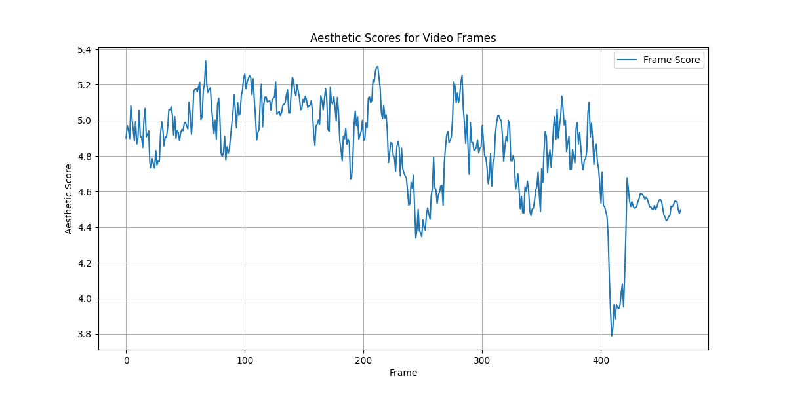
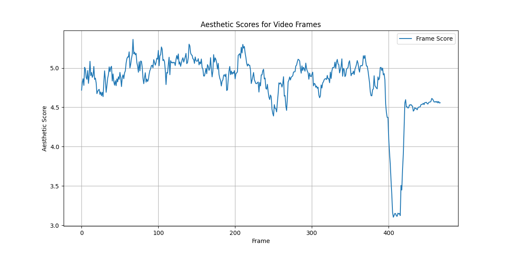
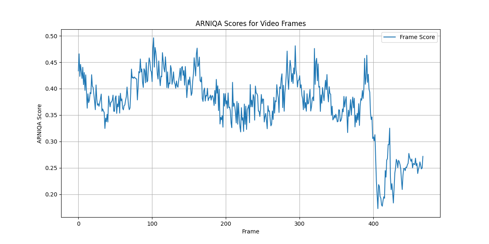
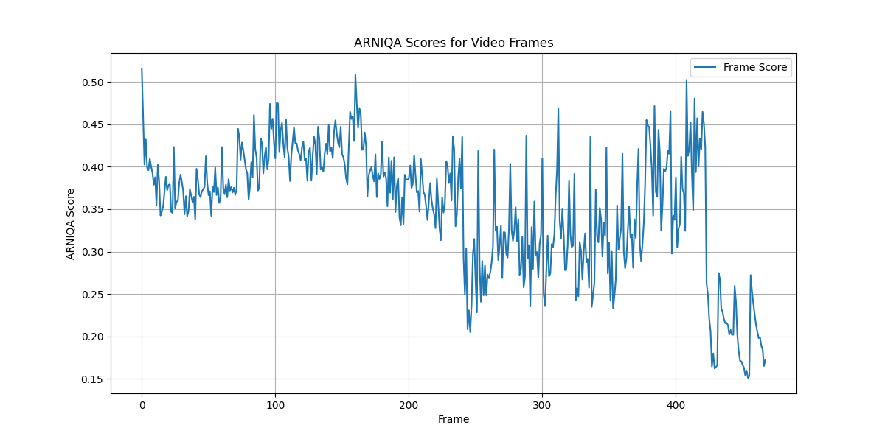

## NIMA Image Quality Assessment Pytorch

For single images scores, you can use the following code:

```bash
python3 test_nima_image.py
```

For video scores, you can use the following code:

```bash
python3 video_analysis_nima.py
```

## ARNIQA Image Quality Assessment Pytorch

https://github.com/miccunifi/arniqa

For single images scores, you can use the following code:

```bash
python3 test_arniqa_image.py
```

For video scores, you can use the following code:

```bash
python3 video_analysis_arniqa.py
```

### NIMA Resutls

**Normal Image**


**Blurred Image**


### ARNIQA Resutls

**Normal Image**


**Blurred Image**
